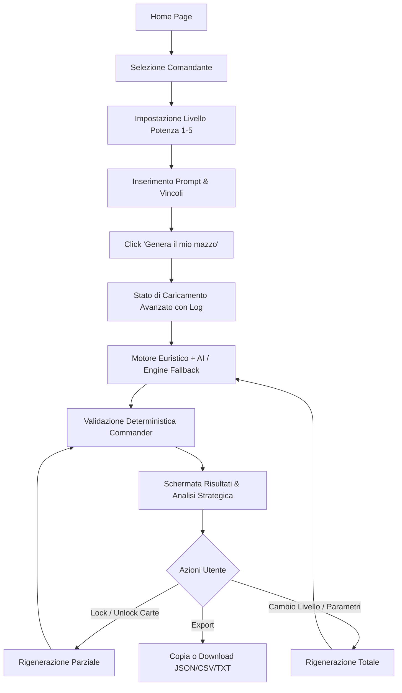

# PRODUCT_SPEC.md — Lazy Builder

## 1. Breve Descrizione del Prodotto
**Lazy Builder** è una piattaforma web innovativa e intelligente per la creazione assistita di mazzi Commander/EDH (Magic: The Gathering). Unisce un motore deterministico di validazione delle regole di Magic e analisi euristica con l'intelligenza artificiale per interpretare i desideri del giocatore e generare mazzi completi da 100 carte pronti per il gioco, bilanciati, legali e spiegati nei minimi dettagli.

## 2. Proposta di Valore (Value Proposition)
- **Zero Fatica, Massima Coerenza**: Costruire un mazzo Commander da 100 carte richiede ore di ricerca tra oltre 25.000 carte. Lazy Builder fa il lavoro pesante in pochi secondi.
- **Garanzia di Legalità e Coerenza Tecnico-Strategica**: Nessun errore di identità di colore, carte cEDH inserite in mazzi casual, o basi di mana disastrose. I mazzi sono legalmente validi e strategicamente sani.
- **Adattabilità a Ogni Livello (Power Level 1-5)**: Dalle partite casalinghe veloci e tematiche ai tavoli cEDH ad altissima sinergia e velocità.
- **Trasparenza Strategica**: Ogni carta inclusa ha una spiegazione chiara e il mazzo include una guida strategica completa su come giocare i primi turni, la metà partita e la chiusura.

## 3. Problema Risolto
1. **Sindrome del Foglio Bianco**: I giocatori spesso faticano a tradurre un'idea d'effetto (es. "voglio sacrificare Goblin per fare danni continui") in una lista ottimizzata da 100 carte.
2. **Tempo Elevato di Deckbuilding**: Trovare il bilanciamento ideale tra ramp, pescaggio, rimozioni e terre richiede calcoli e revisioni continue.
3. **Mancanza di Feedback sul Power Level**: Spesso i giocatori creano mazzi squilibrati rispetto al proprio gruppo di gioco (playgroup).

## 4. Profili Utente (User Personas)

### Persona A: Marco (Giocatore Principiante)
- **Anni di gioco**: < 1 anno.
- **Obiettivo**: Giocare con gli amici nel weekend senza sentirsi sopraffatto dalle regole di deckbuilding.
- **Esigenze**: Cerca un comandante simpatico, sceglie il Livello 1-2, inserisce una descrizione semplice ("voglio draghi grandi che volano") e vuole capire subito come si gioca il mazzo.

### Persona B: Elena (Giocatore Casual / Intermedio)
- **Anni di gioco**: 3-5 anni.
- **Obiettivo**: Costruire mazzi tematici ma ben bilanciati e sinergici (Power Level 3).
- **Esigenze**: Ha vincoli di budget o carte preferite che deve per forza includere. Vuole personalizzare, bloccare carte chiave e fare fine-tuning della base di mana.

### Persona C: Luca (Giocatore Competitivo / cEDH)
- **Anni di gioco**: 10+ anni.
- **Obiettivo**: Ottimizzare la velocità, la curva di mana e la consistenza delle combo (Power Level 4-5).
- **Esigenze**: Exclude cards lente, richiede tutor efficienti, acceleratori a costo 0-1, interazioni veloci e combo compatte con validazione immediata.

## 5. Casi d'Uso Principali
1. **Generazione Assistita Completa**: L'utente seleziona comandante, livello (1-5) e descrive il mazzo; ottiene 100 carte divise per tipo e funzione con guida strategica.
2. **Fine-Tuning & Lock Carte**: L'utente blocca le carte che ama e rigenera le categorie rimanenti (es. "aumenta ramp", "versione più economica").
3. **Validazione e Audit**: Il sistema verifica legalità Commander, identità di colore, conteggio 100 carte e coerenza della mana curve.
4. **Esportazione Multi-formato**: Copia rapida per Moxfield, Archidekt, MTGA o TXT/JSON/CSV per l'acquisto su Cardmarket/TCGPlayer.

## 6. Flusso Utente Completo

## 7. Funzionalità dell'MVP (In Scope per V1)
- Autocompletamento e ricerca comandanti reali tramite API Scryfall (con fallback locale demo).
- Selettore di livello competitivo da 1 a 5 con parametri specifici.
- Form di input per descrizione libera e vincoli (budget, combo infinite, carte incluse/escluse, n. terre).
- Generatore intelligente di mazzi 100 carte basato su euristiche MTG + opzione AI.
- Validatore deterministico (100 carte exact, identità colore, banned list, duplicati).
- Categorizzazione doppia: per Tipo (Creature, Artefatti...) e Funzionale (Ramp, Pescaggio, Tutor, Combo...).
- Guida strategica dettagliata (Early game, Mid game, Late game, Wincons, Weaknesses).
- Sistema di Lock/Unlock carte e rigenerazione parziale/modifiche guidate.
- Esportazione in TXT, JSON, CSV e formato per clipboard (Moxfield/Archidekt compatible).
- Interfaccia modernissima, reattiva e completamente responsive (Desktop + Smartphone).

## 8. Funzionalità da Rimandare (Out of Scope per MVP)
- Autenticazione utente e salvataggio mazzi su Cloud DB.
- Integrazione diretta con API Cardmarket / TCGPlayer cart.
- Simulatore di mano iniziale e probabilità di pescata avanzate.
- Social sharing, rating e commenti.

## 9. Principali Rischi del Progetto e Mitigazioni
- **Rischio API Rate Limit Scryfall**: Mitigato tramite caching locale (LocalStorage/In-memory) e debouncing nell'autocompletamento.
- **Rischio Risposta AI Incoerente o Allucinata**: Mitigato con il motore deterministico che valida, filtra e corregge la lista prima della visualizzazione.
- **Rischio Assenza API Key AI**: Mitigato implementando un motore euristico-algoritmetico integrato che funziona al 100% senza chiavi esterne (Modalità Demo).

## 10. Criteri di Successo del Prodotto
- Tempo di generazione < 3 secondi in modalità euristica e < 8 secondi in modalità AI.
- 100% di conformità alle regole di legalità Commander (100 carte, colori corretti, no banned list).
- Punteggio di gradimento dell'interfaccia (UI/UX eccellente, responsive e priva di errori di layout).
