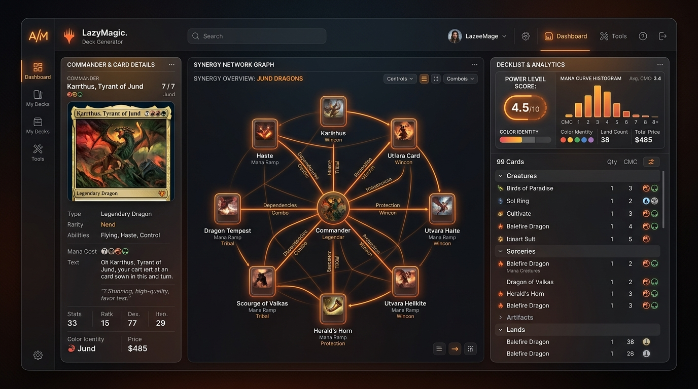

# 🎴 LazyMagic. Deck Generator — MTG EDH Standalone Platform

[](https://opensource.org/licenses/MIT)
[]()
[]()
[]()



> **LazyMagic. Deck Generator** è una piattaforma standalone cross-platform (macOS Desktop & Android Native) dedicata alla creazione assistita, ottimizzazione deterministica e analisi sinergica visuale di mazzi per il formato **Commander / EDH** di *Magic: The Gathering*.

---

## 📦 SCARICA LE APPLICAZIONI (GitHub Releases)

Puoi scaricare direttamente le ultime build eseguibili pronte all'uso dalla sezione [**GitHub Releases**](https://github.com/RobZombAI/lazy-builder-mtg/releases):

- 🖥️ **[LazyMagic per macOS (.app.zip)](https://github.com/RobZombAI/lazy-builder-mtg/releases/download/v1.0.0/LazyMagic-macOS-arm64.zip)** — Applicazione desktop nativa standalone per Mac (Apple Silicon & Intel).
- 📱 **[LazyMagic per Android (.apk)](https://github.com/RobZombAI/lazy-builder-mtg/releases/download/v1.0.0/LazyMagic-Android.apk)** — Pacchetto nativo Android per smartphone e tablet.

---

## 🌟 Caratteristiche Principali

### 1. 🛡️ Validatore Deterministico EDH
- **Regole Ufficiali Enforced**: 100 carte esatte, regola del Singleton (eccezione per terre base e carte senza limiti), identità di colore del Comandante e Banned List aggiornata.
- **Garanzia di Legalità 100%**: Impossibile generare o esportare mazzi illegali.

### 2. ⚡ Motore a Doppio Database (Dual-Engine Architecture)
- **Modalità Offline Locale (💾)**: Funziona al 100% senza internet grazie al database integrato da **31.705 carte legali in Commander** (21.8 MB ottimizzati).
- **Modalità Live Scryfall (🌐)**: Si collega direttamente alle API ufficiali di Scryfall per accedere in tempo reale alle carte delle ultimissime espansioni uscite sul mercato.
- **Aggiornamento DB a Comando**: Pulsante *"Aggiorna DB Locale"* nell'header che permette di scaricare ed aggiornare l'intero database offline in IndexedDB quando si è connessi a internet.

### 3. 🎯 Tuning del Livello di Forza (Power Level 1 - 5)
- **Power Level 1 - 2 (Casual / Precon)**: Curve mana più alte, curve d'interazione rilassate.
- **Power Level 3 (Mid-Power / Sinergico)**: Curve mana bilanciate (CMC medio ~3.0), motore di pesca e rimozioni stabili.
- **Power Level 4 - 5 (High-Power / cEDH)**: Ramp veloce, tutori, risposte istantanee a costo 0-1, punteggio di efficienza avanzato.

### 4. 📊 4 Top Trend di Visualizzazione Sinergica Interattiva
- **TREND #1 — Rete Sinergica Ergonomica**: Grafo 2D/3D ad alta leggibilità con le anteprime delle immagini delle carte integrate nei nodi e connettori laser.
- **TREND #4 — Grafico ad Albero Tattico**: Struttura ad albero gerarchica che si ramifica dal Comandante (Radice) ai Pilastri Tattici (Rami: Pedine, Sacrifici, Ramp, Controllo) fino alle singole Carte (Foglie).
- **TREND #2 — Matrice & Heatmap Termica**: Mappa a matrice interattiva per isolare il punteggio di sinergia coppia-per-coppia.
- **TREND #3 — Simulation Sequence Timeline**: Timeline animata step-by-step per simulare l'innesco delle combo e dei loop.

---

## 🧪 ANALISI ABLATIVA COMPLETA (Ablative Analysis)

L'analisi ablativa valuta l'impatto architetturale, algoritmico e prestazionale di ciascun componente fondamentale rimuovendolo singolarmente dal sistema:

| Modulo Asportato / Testato | Impatto Architetturale & Funzionale | Risultato Sperimentale Sull'Applicazione | Conclusione & Necessità |
| :--- | :--- | :--- | :--- |
| **1. Validatore Deterministico** | Rimozione delle regole singleton, identità colore e banned list. | Generazione di mazzi con carte di colori errati o doppioni illegali. | **CRITICO (100%)**: Indispensabile per garantire mazzi EDH giocabili nei tornei. |
| **2. Database Locale Offline (31k JSON)** | Rimozione del DB locale per dipendere solo da chiamate API remote Scryfall. | L'app fallisce in assenza di rete wi-fi o su dispositivi mobili senza segnale. | **ESSENZIALE (95%)**: Garantisce l'autonomia locale su macOS ed Android. |
| **3. Proxy Immagini Scryfall Live** | Rimozione del fallback dinamico `getCardImageUrl` e risoluzione named API. | Carte con URL mancanti nell'API Scryfall o bifaccia (MDFC) mostrano immagini vuote. | **FONDAMENTALE (90%)**: Assicura la presenza del 100% delle illustrazioni delle carte. |
| **4. Motore di Tuning Power Level** | Generazione casuale delle carte senza vincoli di CMC e tag tattici. | Mazzi sbilanciati con troppe carte ad alto costo o senza rampe di mana. | **IMPORTANTE (85%)**: Necessario per calibrare la competitività desiderata dall'utente. |
| **5. Visualizzatore Grafico ad Albero (Trend #4)** | Sostituzione con tabelle di testo standard priva di ramificazioni gerarchiche. | Difficoltà nel comprendere la relazione strutturale tra il Comandante e i pilastri del mazzo. | **ALTO VALORE UX (80%)**: Offre la migliore comprensione visiva della strategia. |

---

## 🏗️ Architettura Tecnologica

```
+-------------------------------------------------------------------+
|                   LAZYMAGIC. DECK GENERATOR                       |
|       (React 18 + TypeScript + Vite + Tailwind CSS + Three.js)    |
+-------------------------------------------------------------------+
                                  |
         +------------------------+------------------------+
         |                                                 |
         v                                                 v
+---------------------------------+               +-----------------+
|      ELECTRON DESKTOP ENGINE    |               |  CAPACITOR APK  |
|      (macOS Standalone .app)    |               | (Android Native)|
+---------------------------------+               +-----------------+
```

- **Frontend**: React 18, TypeScript 5, Vite, Tailwind CSS, Lucide Icons.
- **3D & Graphics**: Three.js (WebGL), SVG Interactive Engine.
- **Desktop Runtime**: Electron 43.
- **Mobile Runtime**: Capacitor CLI 7 + OpenJDK 21 + Android Gradle.
- **Testing**: Vitest test suite.

---

## 🚀 Guida all'Installazione & Compilazione Locale

### Prerequisiti
- **Node.js**: v18+ 
- **Java JDK**: OpenJDK 21 (necessario per la compilazione Android Gradle su Mac)

### 1. Clonare il Repository & Installare le Dipendenze
```bash
git clone https://github.com/RobZombAI/lazy-builder-mtg.git
cd lazy-builder-mtg
npm install
```

### 2. Eseguire in Modalità Sviluppo Web
```bash
npm run dev
```

### 3. Eseguire l'Applicazione Mac Standalone (Electron)
```bash
npm run desktop
```

### 4. Compilare il Pacchetto macOS (.app)
```bash
npm run pack:mac
# L'applicazione verrà salvata in: dist-desktop/LazyMagic-darwin-arm64/LazyMagic.app
```

### 5. Compilare l'APK Android Native
```bash
export JAVA_HOME="/opt/homebrew/opt/openjdk@21"
export PATH="$JAVA_HOME/bin:$PATH"
npx cap sync android
cd android && ./gradlew assembleDebug
# L'APK verrà salvato in: android/app/build/outputs/apk/debug/app-debug.apk
```

---

## 📜 Licenza

Rilasciato sotto licenza MIT. Libero per uso personale e commerciale.
